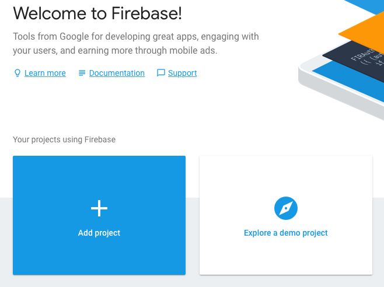
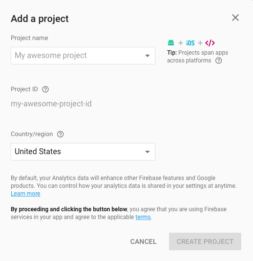
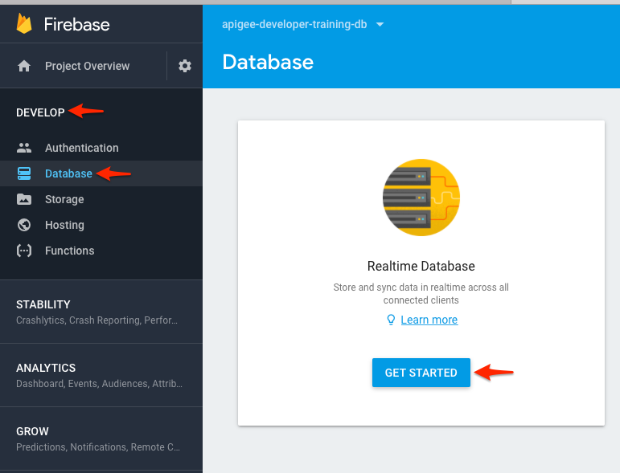
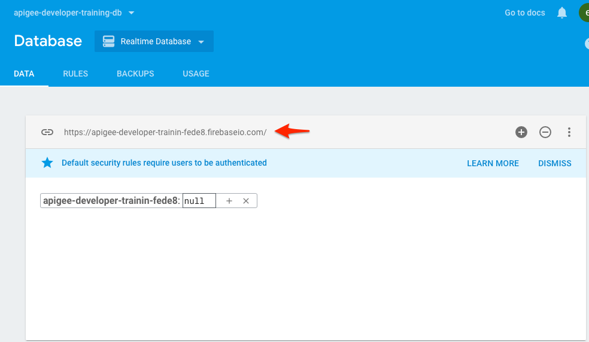
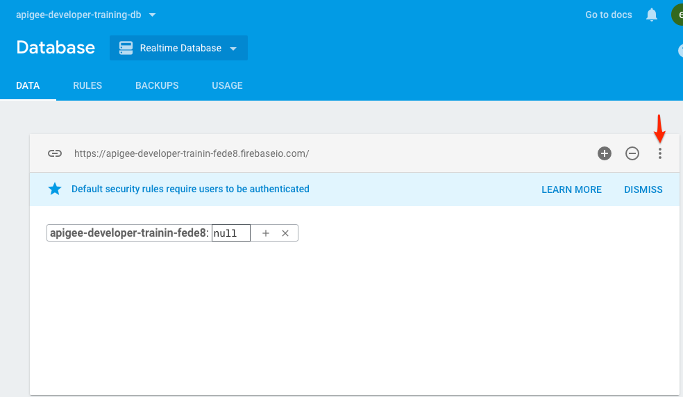
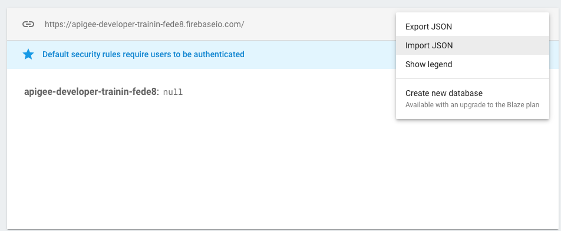
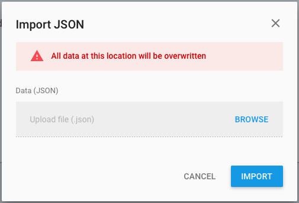
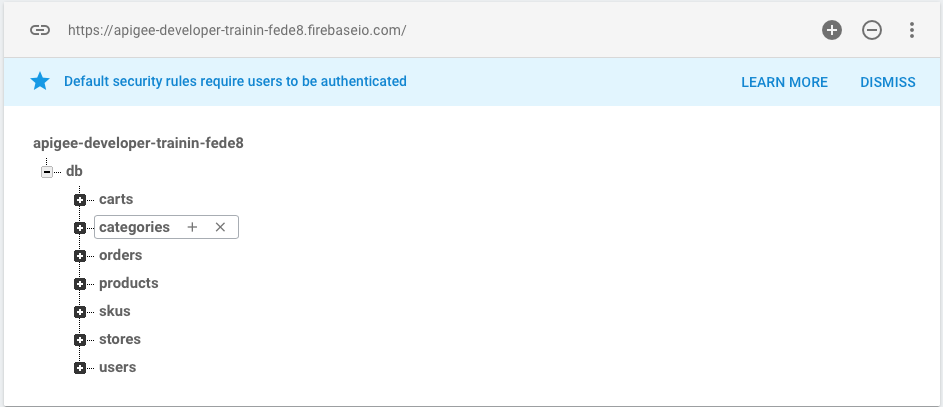

# Apigee API Management
Curso de capacitación de Apigee API Management.

- [Apigee API Management](#apigee-api-management)
  - [Roadmap del curso](#roadmap-del-curso)
  - [Referencias](#referencias)
- [Setup para laboratorios](#setup-para-laboratorios)
  - [Introducción](#introducción)
  - [Pre-requisitos](#pre-requisitos)
  - [Acceso a Firebase e importación de data](#acceso-a-firebase-e-importación-de-data)

## Roadmap del curso

1. API Management.
    1. Introduction to APIs.
    2. API Platforms.
    3. API Management Fundamentals.
2. Apigee Design.
    1. Apigee Fundamentals 
    2. API Design.
    3. Best Practices.
    4. Open API.
    5. Practice Lab.
3. Apigee Development (part-1). 
    1. API Proxy.
    2. API Policies.
    3. Target Servers. 
    4. API Products. 
    5. Debugging APIs. 
    6. Practice Lab.
4. Apigee Development (part-2). 
    1. API Proxy.
    2. API Policies.
    3. Target Servers. 
    4. API Products. 
    5. Debugging APIs. 
    6. Practice Lab.
5. Security.
    1. API Keys. 
    2. OAuth 2.0. 
    3. TLS.
    4. Practice Lab.
6. Monitoring.
    1. API Metrics. 
    2. Analytics. 
    3. Alerts.

## Referencias

1. Weir, Luis, 2019. Enterprise API Management.
2. De, Brajesh, 2017. API Management.
3. Fernandez-Buglioni, Eduardo, 2013. Security Patterns In Practice.
4. https://github.com/apigeecs/apigee-engg-training-lab-resources
5. https://github.com/apigeecs/apigee-apimocker
6. http://docs.apigee.com/api-services/content/build-simple-api-proxy
7. http://docs.apigee.com/api-services/content/best-practices-api-proxy-design-and-development
8. http://docs.apigee.com/api-services/content/using-trace-tool-0
9. https://community.apigee.com/topics/trace.html
10. http://docs.apigee.com/api-services/reference/spike-arrest-policy
11. http://docs.apigee.com/api-services/content/rate-limiting
12. http://docs.apigee.com/api-services/reference/quota-policy
13. https://community.apigee.com/questions/1488/how-do-the-quota-settings-on-an-api-product-intera.html
14. http://docs.apigee.com/api-services/content/comparing-quota-spike-arrest-and-concurrent-rate-limit-policies
15. https://docs.apigee.com/api-services/reference/assign-message-policy
16. https://docs.apigee.com/api-services/reference/basic-authentication-policy
17. https://docs.apigee.com/api-services/reference/key-value-map-operations-policy
18. https://docs.apigee.com/api-services/content/load-balancing-across-backend-servers

# Setup para laboratorios

## Introducción
Un target-endpoint es necesario para completar los laboratorios de este programa. Éste lo haremos con [Firebase Realtime database](https://firebase.google.com/docs/database/), donde consultaremos la data almacenada allí.

A medida que trabajemos con el material de laboratorio, intentaremos desarrollar una API para una empresa ficticia de comercio electrónico llamada Moon Digital. Este laboratorio configurará un almacén de datos de muestra con API para que actúen como servicios de comercio electrónico backend de Moon Digital para la gestión de productos, gestión de pedidos, gestión de inventario, entre otros.

## Pre-requisitos
Antes de comenzar, necesitarás instalar lo siguiente:
- Crear una cuenta en Apigee Edge. Puedes guiarte con esta documentacioón --> [docs](http://docs.apigee.com/api-services/content/creating-apigee-edge-account).
- Deberás instalar [Node.js](https://nodejs.org/en/download/) en tu máquina local. Esto también instalará el paquete: node package manage [npm](https://www.npmjs.com/).
- Una cuenta [Google Cloud Platform](https://accounts.google.com/signin/v2/identifier?service=cloudconsole&passive=1209600&osid=1&continue=https%3A%2F%2Fconsole.cloud.google.com%2Ffreetrial%3F_ga%3D2.45407329.414976149.1517252141-1035065838.1517252141%26ref%3Dhttps%3A%2F%2Fcloud.google.com%2F&followup=https%3A%2F%2Fconsole.cloud.google.com%2Ffreetrial%3F_ga%3D2.45407329.414976149.1517252141-1035065838.1517252141%26ref%3Dhttps%3A%2F%2Fcloud.google.com%2F&flowName=GlifWebSignIn&flowEntry=ServiceLogin).    
- [Java SDK >= 8](http://www.oracle.com/technetwork/java/javase/downloads/index.html).
- [Maven 3.x](https://maven.apache.org/).

## Acceso a Firebase e importación de data

1. Ir a [https://firebase.google.com](https://firebase.google.com)

2. Haz click en el botón **SIGN IN** en la esquina superior derecha de la pantalla. Si no tienes una cuenta, debes registrarte para obtener una.

3. Haz click en el botón **+ Add project** para crear un nuevo proyecto.

4. En la pantalla "Add a Project" ingresa "apigee-developer-training-db" y luego haz click en el botón **Create Project**.

5. Click **Develop** > **Database** y luego click en el botón **GET STARTED**.

6. Verás la URL de la base de datos para acceder a la instancia de Firebase.

7. Para importar todos los datos a Firebase debes hacer click en los 3 puntos ubicados a la derecha de su pantalla. Luego click en **Import JSON**.

8. Click en el botón **Browse** y selecciona el archivo **firebase-all.json** localizado en la carpeta `sessions/session-03/data`. Luego haz click en el botoón **IMPORT**.

9. Puedes ver que todos los datos se cargaron correctamente.

